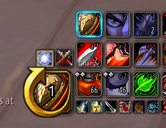

# 🔑 AssKey 

## Problem

Single Button Assistant shows a static keybind to invoke the Single Button Assistant but does not show a dynamic keybind to invoke the recommended ability.

## Solution

- Show dynamic recommended keybinds on Single Button Assistant

## Usage

- Open Options->AddOns->AssKey to change options.
  - Can also open options from addon compartment menu.
  - Can also open options with /ak or /asskey.
